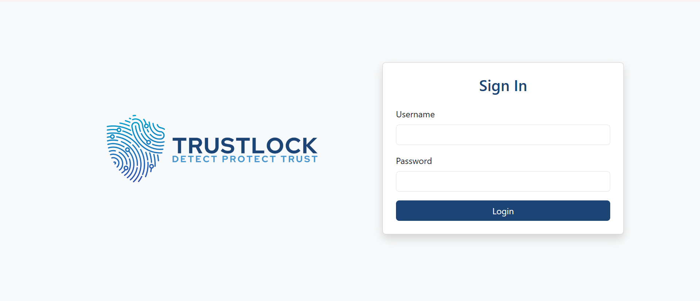
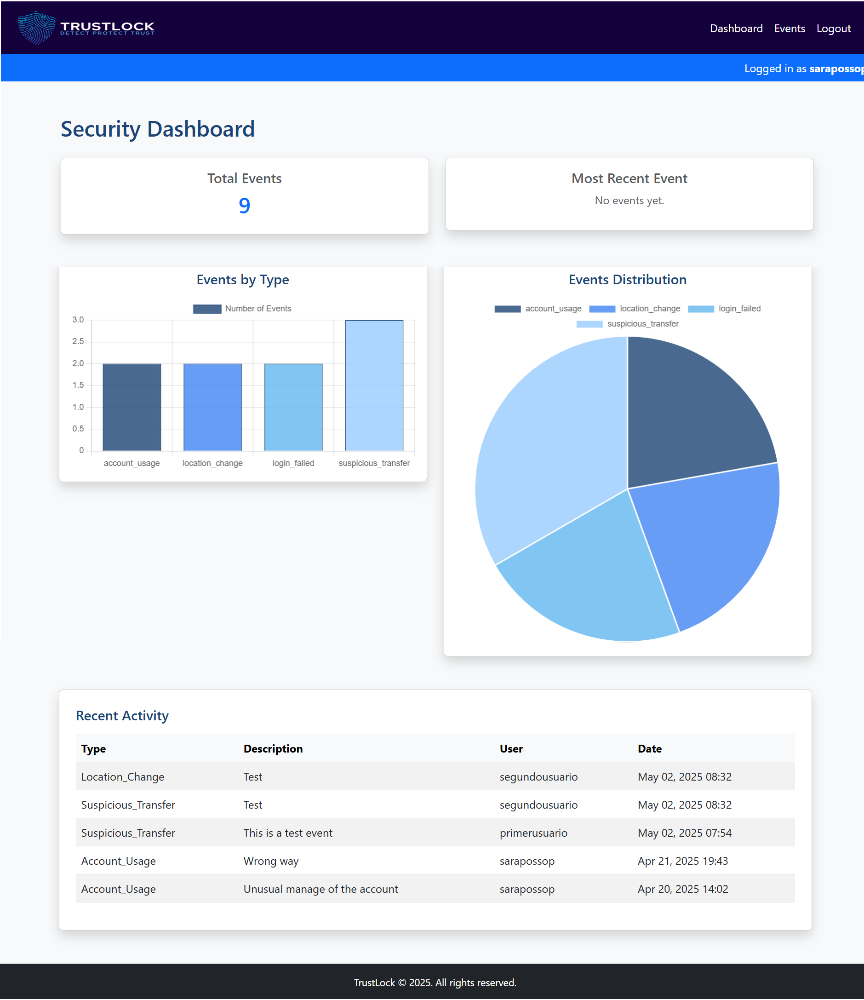
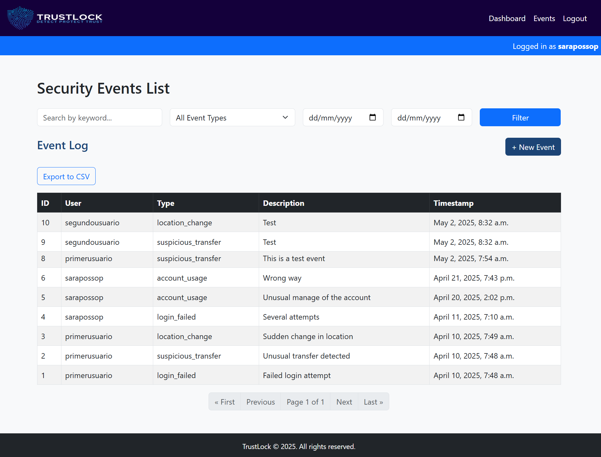
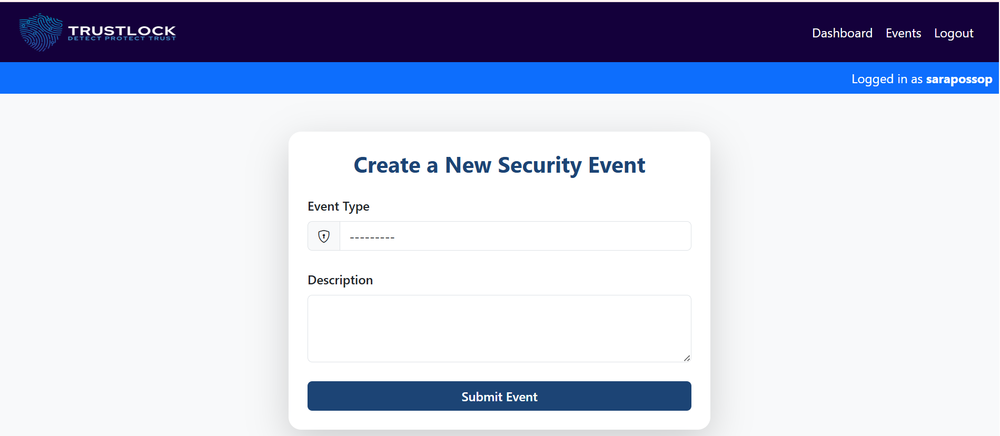
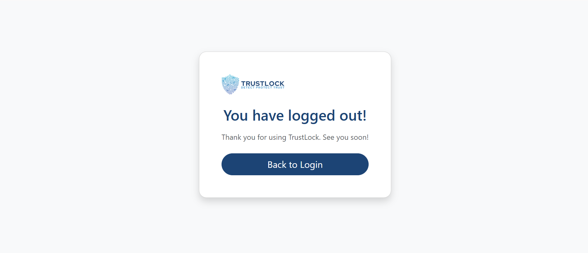

# 🔒 TrustLock

TrustLock is a **security event monitoring platform** designed to help organizations detect suspicious activity, monitor account usage, and maintain compliance — all through a simple, elegant web dashboard.


---

## 🚀 Features

- 🔐 User authentication (admin and standard roles)
- 🧾 Create and manage security events
- 📊 Dashboard with charts (bar & pie)
- 🔎 Event filtering by type, date, and keyword
- 📱 Fully responsive (mobile-friendly)
- 📤 Export events to CSV
- 🛡️ Role-based visibility (users only see their events)
- ✨ Clean UI with custom branding

---

## 🏢 Use Cases

- **IT departments** needing traceability for security audits
- **Banks or corporate teams** that track login anomalies or usage patterns
- **Startups or SaaS platforms** required to comply with data protection standards

---

## 🖼️ Screenshots

### 🔐 Login Page



### 📊 Dashboard


### 📋 Events


### ➕ Create Events


### 🚪 Logout


---

## ⚙️ Tech Stack

- Backend: `Django 5`, `SQLite`, `Django Authentication`, `Messages Framework`
- Frontend: `Bootstrap 5`, `Chart.js`, `widget-tweaks`
- Style: blue-gray-white color palette
- Export: `CSV` format

---

## 💻 Local Setup

```bash
git clone https://github.com/yourusername/trustlock.git
cd trustlock
python3 -m venv env
source env/bin/activate
pip install -r requirements.txt
python manage.py migrate
python manage.py createsuperuser
python manage.py runserver


TrustLock/
├── dashboard/
│   ├── _pycache_/
│   │    ├── admin.cpython-321.pyc
│   │    ├── forms.cpython-321.pyc
│   │    ├── models.cpython-321.pyc
│   │    ├── urls.cpython-321.pyc
│   │    └── views.cpython-321.pyc
│   ├── migrations/
│   │   ├── _pycache_/
│   │   │   ├── _init_.cpython-321.pyc
│   │   │   ├── 0001_initial.cpython-321.pyc
│   │   │   └── 0002_securityevent_user.cpython-321.pyc
│   │   ├──_init_.py
│   │   ├──0001_initial.py
│   │   └──0002_securityevent_user.py
│   ├── static/
│   │    ├── css/
│   │    │   └── styles.css
│   │    ├── images/     
│   │    │   ├── trustlock_logo.png
│   │        └── trustlock_logoblanco.png 
│   ├── templates/
│   │   ├── base_login.html
│   │   ├── base.html
│   │   ├── create_event.html
│   │   ├── dashboard_stats.html
│   │   ├── event_list.html
│   │   ├── login.html
│   │   ├── logout.hml
│   │   └── styles.css
│   ├── admin.py
│   ├── forms.py
│   ├── models.py
│   ├── urls.py
│   └── views.py
├── env/
├── screenshots/
├── trustlock_project/
│   │   ├── _pycache_/
│   │   │   ├── _init_.cpython-321.pyc
│   │   │   ├── settings.cpython-321.pyc
│   │   │   ├── urls.cpython-321.pyc
│   │   │   └── wsgi.cpython-321.pyc
│   │   ├── _init_.py
│   │   ├── asgi.py
│   │   ├── settings.py
│   │   ├── urls.py
│   │   └── wsgi.py 
├── db.sqlite3
├── manage.py
└── README.md
